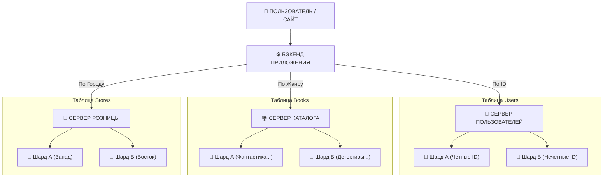

# Домашнее задание к занятию "Репликация и масштабирование. Часть 2" - Болов Кантемир

### Задание 1

Опишите основные преимущества использования масштабирования методами:

активный master-сервер и пассивный репликационный slave-сервер;
master-сервер и несколько slave-серверов;

Дайте ответ в свободной форме.

**Ответ**

Активный master-сервер и пассивный репликационный slave-сервер.

Все операции записи идут только через master, Slave незаметно копирует все изменения в реальном времени.

***Основные преимущества:*** 

- **Отказоустойчивость** — если master выйдет из строя, slave можно оперативно повысить до роли master.
- **Безопасность** — на случай аварии можно откатиться с запасного.
- **Распределение** — часть запросов на чтение можно перебросить на slave, тем самым разгрузив работу master на записи.

Схема актуальна для повышения отказоустойчивости, а не масштабирования.

Master-сервер и несколько slave-серверов.

- **Горизонтальная масштабируемость** — нагрузка от запросов на чтение распределяется между новыми slave.
- **Отказоустойчивость** — если один из slave-серверов выйдет из строя, система продолжит работать, запросы на чтение будут направляться на оставшиеся доступные серверы.
- **Гибкость** — при росте нагрузки можно добавлять новые и, если нужно, убирать лишние.

Если нагрузка в основном на чтение, схема с несколькими slave даст более заметный прирост производительности за счёт распределения чтения.

### Задание 2

Разработайте план для выполнения горизонтального и вертикального шаринга базы данных. База данных состоит из трёх таблиц: пользователи, книги, магазины (столбцы произвольно).

Опишите принципы построения системы и их разграничение или разбивку между базами данных. Опишите, в каких режимах будут работать сервера.

- **Пользователи (`users`)** — люди, которые регистрируются.
- **Книги (`books`)** — каталог товаров.
- **Магазины (`stores`)** — физические точки продаж.

**Вертикальный шаринг** 

- **Сервер №1 (Сервер пользователей):** `users`.
- **Сервер №2 (Сервер каталога):** `books`.
- **Сервер №3 (Сервер розницы):** `stores`.

Если упадет сервер с книгами, база данных пользователей продолжит работать, но БД ничего не знают друг о друге, так как находятся на разных серверах.

**Горизонтальный шаринг**

Из-за наплыва пользователей или увеличения ассортимента количество строк увеличится, что приведет к перегрузке сервера. Для предотвращения делим строки каждой таблицы, распределяя их по шардам.

**Users** — берем ID пользователя и делим его на количество серверов:

- **Шард А:** Все пользователи с четными ID (2, 4, 6, 8...).
- **Шард Б:** Все пользователи с нечетными ID (1, 3, 5, 7...).

*Итог:* Нагрузка на регистрацию и авторизацию размазана ровно 50/50.

**Books** — делим на жанры:

- **Шард А:** Жанры: *Фантастика, Фэнтези, Техническая литература*.
- **Шард Б:** Жанры: *Детективы, Романы, Детские книги*.

Если пользователь заходит в раздел "Фантастика", приложение шлет запрос только на Шард А. Второй сервер в это время отдыхает.

**Stores** — делим по географии:

- **Шард А (Запад):** Магазины в Москве, Санкт-Петербурге, Краснодаре.
- **Шард Б (Сибирь/Восток):** Магазины в Новосибирске, Красноярске, Владивостоке.

Если запрос от покупателя из Сибири — данные обрабатываются на Новосибирском сервере, что положительно сказывается на производительности.

**Режимы работы серверов:**
- **Режим Изолированных Контекстов (Shared Nothing):** для вертикального шаринга. Каждый сервер (Пользователи, Каталог, Розница) полностью автономен и не имеет общих ресурсов со смежными нодами.
- **Режим Активный-Активный (Active-Active):** для горизонтальных шардов. Шард А и Шард Б внутри каждой таблицы работают параллельно и одновременно принимают нагрузку.

